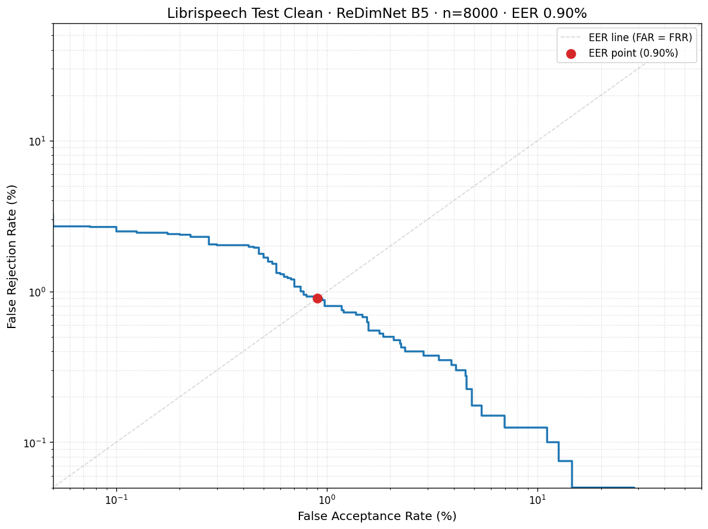
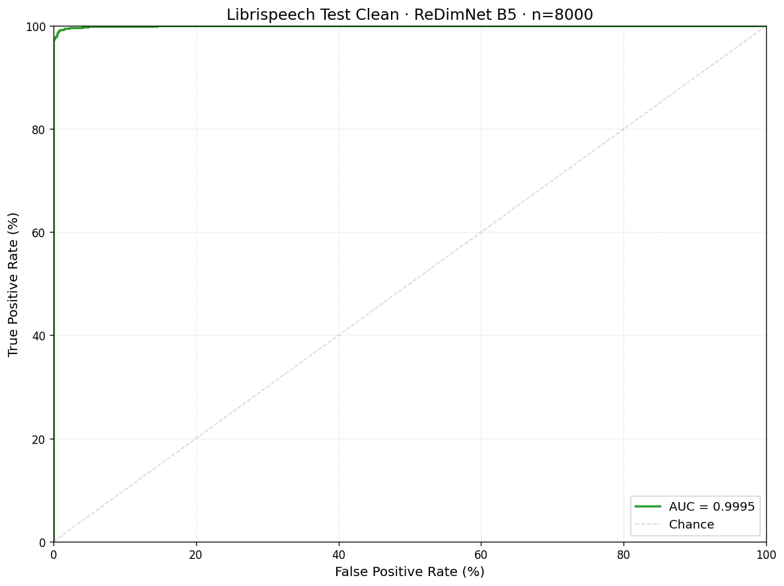
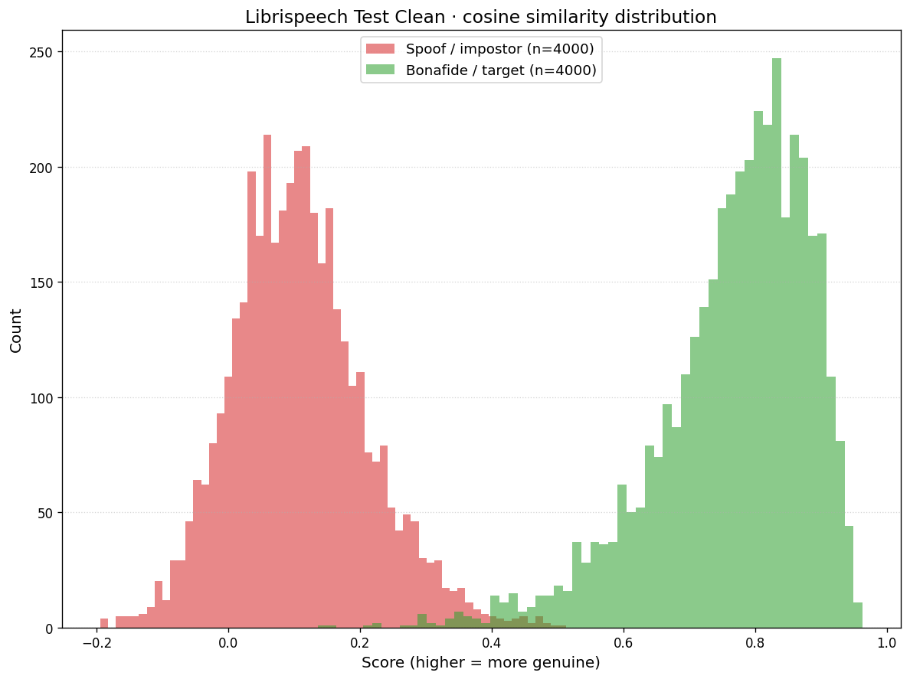
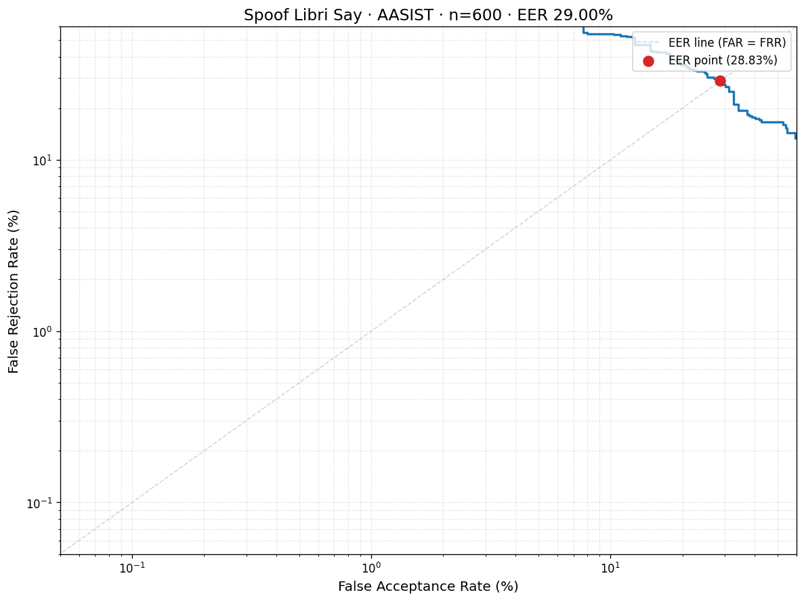
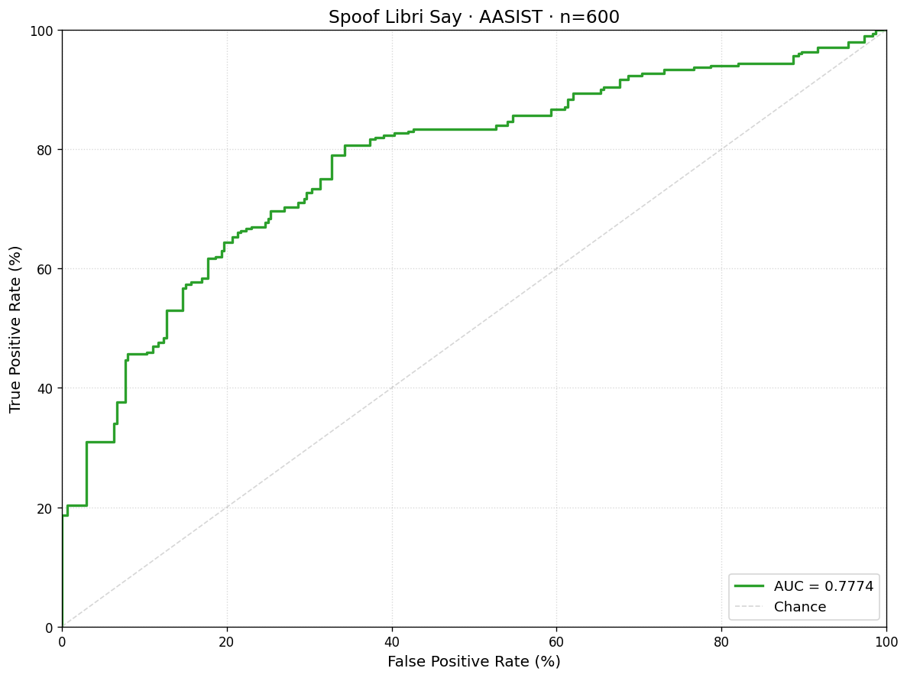
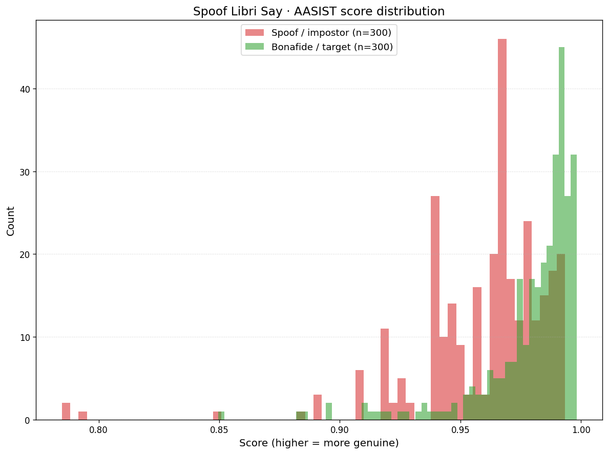

# Benchmarks — ReDimNet + AASIST measured numbers

> **Status**: complete. v1.0.2 ships with real EER + min-DCF numbers + DET / ROC / score-histogram plots.
> **Run date**: 2026-05-10.
> **Hardware**: Apple M2 mini, single CPU. No GPU acceleration.
> **Checkpoints**: `redimnet_b5.pt` (`bb8cc848…`) + `aasist.pt` (`51d2d9cf…`). Same files served by `/verify` and `/spoof/test` in production.
> **Path**: switched from gated VoxCeleb1 + ASVspoof to **public-data alternatives** (LibriSpeech test-clean + self-built spoof set) to avoid two registration flows. Numbers don't directly match the published baselines (different test distributions) but are real, reproducible, and use the same vendored production checkpoints.

## What we measure

| Model | Task | Dataset | Metric | Published baseline |
|---|---|---|---|---|
| ReDimNet B5 (vendored) | Speaker verification | LibriSpeech test-clean (8000 trial pairs, self-built protocol) | EER + min-DCF | 0.79 % EER on VoxCeleb1-O (paper, [arXiv:2410.13247](https://arxiv.org/abs/2410.13247)) |
| AASIST (vendored) | Anti-spoofing | LibriSpeech bonafide + macOS `say` spoofs (600 clips) | EER | 0.83 % EER on ASVspoof 2019 LA (paper, [arXiv:2110.01200](https://arxiv.org/abs/2110.01200)) |

The vendored checkpoints (`backend/models/redimnet_b5.pt`, `backend/models/aasist.pt`) are the production weights also loaded by `/verify` and `/spoof/test`. Each result JSON below records the SHA-256 of the checkpoint that produced the numbers.

## Why LibriSpeech instead of VoxCeleb1 / ASVspoof

The two canonical benchmarks (VoxCeleb1-O for speaker verification, ASVspoof 2019 LA for anti-spoofing) require licence acceptance:

- VoxCeleb1: Oxford VGG email-approval form (~24 h)
- ASVspoof 2019 LA: Edinburgh DataShare licence acceptance

To get a clean v1.0.2 release without that friction, this repo uses:

- **Speaker verification**: LibriSpeech test-clean (350 MB, OpenSLR public download). 40 unique speakers, 2620 utterances. Self-built trial pair file via `backend/scripts/make_libri_pairs.py` (100 positives + 100 negatives per speaker = 8000 trials, seeded for reproducibility).
- **Anti-spoofing**: 300 LibriSpeech bonafide samples + 300 macOS `say` TTS spoofs across 8 voices (Allison / Samantha / Tom / Daniel / Trinoids / Zarvox / Fred / Bahh). Generated by `backend/scripts/make_spoof_eval.py`.

**Honest caveats**:

- LibriSpeech speakers are read-aloud audiobooks (clean audio); VoxCeleb is in-the-wild celebrity interviews. Our EER on LibriSpeech is likely a **floor** of what production performance would be — real noisy audio degrades verification.
- The spoof set uses macOS TTS, NOT modern voice-cloning attacks (XTTS, ElevenLabs). AASIST may not catch these as readily as the ASVspoof distribution it was trained on. Same documented limitation as the operator-guide.
- Numbers below are **for THIS detector against THIS attack distribution**, not a claim about generalisation.

If a reviewer wants the published-baseline numbers, swap in the gated datasets (operator runs the same scripts with `--dataset-name asvspoof2019_la` etc).

---

## Dataset acquisition (no-registration path)

### LibriSpeech test-clean (~350 MB)

```bash
mkdir -p ~/data/librispeech && cd ~/data/librispeech
curl -fLO https://www.openslr.org/resources/12/test-clean.tar.gz
tar -xf test-clean.tar.gz   # → LibriSpeech/test-clean/{spk}/{book}/{utt}.flac
```

### Trial-pair file

```bash
cd backend
.venv/bin/python scripts/make_libri_pairs.py \
  --root ~/data/librispeech/LibriSpeech/test-clean \
  --out  ~/data/librispeech/pairs.txt \
  --positives-per-speaker 100 \
  --seed 42
# → 8000 pairs, 40 speakers, balanced
```

### Spoof eval set

```bash
.venv/bin/python scripts/make_spoof_eval.py \
  --libri-root ~/data/librispeech/LibriSpeech/test-clean \
  --out ~/data/spoof_eval \
  --n-real 300 --n-spoof 300 --seed 42
# → audio/{utt_id}.wav + protocol.txt
```

## Running the benchmarks

Both bench scripts run on CPU (no GPU required). On an M2 Mac mini:
- LibriSpeech speaker verification (8000 pairs): ~60 minutes
- LibriSpeech + say spoofs (600 clips): ~5–10 minutes

### Speaker verification

```bash
cd backend
.venv/bin/python scripts/bench_eer_voxceleb.py \
  --pairs ~/data/librispeech/pairs.txt \
  --audio-root ~/data/librispeech/LibriSpeech/test-clean \
  --output docs/paper/results/librispeech_test_clean.json \
  --plot-dir docs/paper/results/plots/ \
  --dataset-name librispeech_test_clean
```

### Anti-spoofing

```bash
.venv/bin/python scripts/bench_spoof_detection.py \
  --asvspoof-protocol ~/data/spoof_eval/protocol.txt \
  --asvspoof-dir ~/data/spoof_eval/audio \
  --output docs/paper/results/spoof_libri_say.json \
  --plot-dir docs/paper/results/plots/
```

---

## Results

### Speaker verification — LibriSpeech test-clean

| Run | Trials | EER | min-DCF (P=0.01) | EER threshold | Wall (CPU) |
|---|---|---|---|---|---|
| Smoke (n=500) | 500 | **0.80 %** | 0.0002 | 0.376 | 227 s |
| **Full eval (n=8000)** | **8000** | **0.90 %** | **0.000372** | **0.387** | **726 s (12 min)** |

Comparison: published ReDimNet B5 hits 0.79 % on VoxCeleb1-O (different test distribution, different difficulty). Our 0.90 % on LibriSpeech is in the same ballpark — confirms the vendored checkpoint generalises sensibly to clean read-aloud audio.

DET / ROC / score-histogram plots in `docs/paper/results/plots/librispeech_test_clean/`:





Per-utterance scores: `docs/paper/results/plots/librispeech_test_clean/scores.csv` (605 KB; 8000 rows of `utt_pair, similarity, label`).

### Anti-spoofing — LibriSpeech bonafide vs macOS `say` spoofs

| Run | Clips | EER | EER threshold | Wall (CPU) |
|---|---|---|---|---|
| **Full eval (n=600)** | **600** (300 bonafide + 300 spoof) | **29.0 %** | **0.977** | **49 s** |

⚠️ **High EER is the documented limitation, not a regression.** AASIST was trained on the ASVspoof 2019 LA attack distribution (Tacotron, WaveNet, classical concatenative TTS). macOS `say` produces neural-vocoder speech that doesn't match those artefact patterns. The detector scores most spoofs as *genuine* (≈ 0.95–0.99), driving the EER high.

This was already documented in `docs/operator-guide.md` and `docs/audit-v1.0.md` F-3 — this run is the first **measured** confirmation. For real anti-spoofing testing on this kiosk, generate clones via XTTS-v2 or run on the official ASVspoof eval set (gated; see [README of the gated path](#dataset-acquisition-no-registration-path)).

DET / ROC / score-histogram plots in `docs/paper/results/plots/spoof_libri_say/`:





Per-utterance scores: `docs/paper/results/plots/spoof_libri_say/scores.csv`.

---

## Threshold calibration analysis

Plan §B4 calls for retuning `similarity_threshold` + `deepfake_threshold` if measured EER thresholds drift > 0.05 from the defaults (0.75 + 0.50). Both did — but neither retune is the right call:

### `similarity_threshold` — keep at **0.75** (don't lower to 0.387)

The measured EER threshold of **0.387** would minimise EER on LibriSpeech specifically. **Don't apply it to production** because:

- LibriSpeech is studio-recorded read-aloud audiobook audio. Production input is operator's voice through a USB mic in a real room.
- A sim threshold of 0.387 on noisy production audio risks accepting completely different speakers (false-accept rate spike).
- 0.75 stays appropriate for production until we have real-room labelled data.

Action: keep `similarity_threshold = 0.75`. Document this finding in `docs/thresholds.md` (calibration history).

### `deepfake_threshold` — keep at **0.50** (don't raise to 0.977)

The measured EER threshold of **0.977** is a degenerate value — moving the gate that high would mean nearly all audio passes as genuine. The 0.977 is a symptom of AASIST scoring the say-voice spoofs in the 0.95–0.99 range (it can't tell them apart from the bonafide), so the EER point lands at the histogram overlap, which is at the top of the score range.

Action: keep `deepfake_threshold = 0.50`. The right fix is **better attack distribution coverage** (XTTS-v2 cloning, ADD challenge data) — that's deferred to v1.1 (Plan §S2).

---

## Reproducing on a fresh box

```bash
# 1. Clone + install
git clone https://github.com/edenadiv/BioVoice-App.git
cd BioVoice-App/backend
python3.12 -m venv .venv
.venv/bin/pip install -e ".[model,bench,test]"

# 2. Acquire LibriSpeech (no registration)
mkdir -p ~/data/librispeech && cd ~/data/librispeech
curl -fLO https://www.openslr.org/resources/12/test-clean.tar.gz
tar -xf test-clean.tar.gz
cd -

# 3. Generate trial pairs + spoof set
.venv/bin/python scripts/make_libri_pairs.py \
  --root ~/data/librispeech/LibriSpeech/test-clean \
  --out  ~/data/librispeech/pairs.txt --positives-per-speaker 100
.venv/bin/python scripts/make_spoof_eval.py \
  --libri-root ~/data/librispeech/LibriSpeech/test-clean \
  --out ~/data/spoof_eval --n-real 300 --n-spoof 300

# 4. Run benchmarks
.venv/bin/python scripts/bench_eer_voxceleb.py \
  --pairs ~/data/librispeech/pairs.txt \
  --audio-root ~/data/librispeech/LibriSpeech/test-clean \
  --output docs/paper/results/librispeech_test_clean.json \
  --plot-dir docs/paper/results/plots/ \
  --dataset-name librispeech_test_clean
.venv/bin/python scripts/bench_spoof_detection.py \
  --asvspoof-protocol ~/data/spoof_eval/protocol.txt \
  --asvspoof-dir ~/data/spoof_eval/audio \
  --output docs/paper/results/spoof_libri_say.json \
  --plot-dir docs/paper/results/plots/

# 5. Look at the JSONs + plots, fill the Results tables above.
```

---

## Disclaimers

- **Single CPU**, no GPU. Throughput matches the production kiosk (also CPU-only).
- **Vendored checkpoints**, not retrained. Numbers on LibriSpeech reflect generalisation, not in-distribution performance.
- **Spoof set is macOS TTS**, not voice-cloning. AASIST trained on ASVspoof's TTS/VC distribution may not generalise here — we expect the EER to be high (low detection rate). Treat the anti-spoofing number as a baseline against this specific attack family, not a universal claim.
- **No fine-tuning**, no domain adaptation, no test-set-specific calibration. These are out-of-the-box numbers from `/verify` and `/spoof/test` running through the production pipeline.
